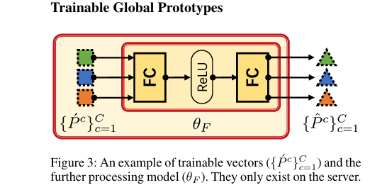
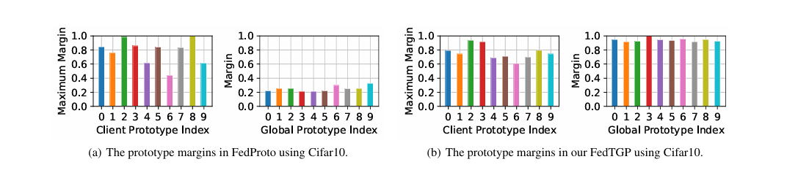
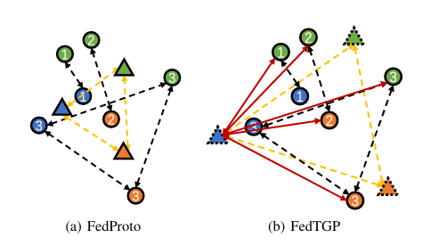

### 1.目前异构联邦学习遇到的问题

​     1.隐私问题，例如个人数据隐私

​     2.数据异构性和客户端的异构性

### 2.现有的异构解决方案

​      1.允许客户端向共享的全局模型架构中对不同的子模型进行采样（缺点：出现隐私问题）

​      2.拆分每个客户端模型，**分为底层和顶层**，**这些客户端可以共享顶层，顶层在全局模型下进行加权聚合**，然后分发给每个客户端

​       保证了客户端的独特性以及实现了每个客户端的交流

​         （缺点：简单的共享加权顶层会导致不好的结果，客户端的异构性导致了这种情况）

​      3.训练一个全局的生成器，用于客户端的获取知识，但**需要生成器的质量比较高**，以及训练全局生成器的数据比较好

​      4.采用相互蒸馏的方式，训练一个小模型，用于各个客户端进行共享，也就是客户端和小模型相互学习，但在训练前期，由于两者

​          提取特征能力较弱，在训练初期会出现相互干扰的情况。

​     5.还有一种方法，每一个客户端在训练时提供本地数据中每个类的原型**（相当于从每一类数据中选出一个特征比较明显的）**，在服 

​        务端上进行加权合并，然后将这些高维原型分享给每个客户端进行训练。（原型其实就是该类别的样本特征向量的平均值）

### 3.作者的采用的方法

作者是基于fedproto（联邦原型学习）进行优化的，该方法就是上述第五种异构解决方案，这样的方案相比于其他的方案的

这种方法借鉴人类学习的方式，**即我们总喜欢记住一些特例，然后用这些特例学习后泛化到其他的模型**

优点为：

##### 1.能够在模型架构和数据分布不一致（异构性高）的情况下进行有效学习。每个客户端仅需传递类别的**原型向量**（即特征均值），而非梯度或模型参数，因此支持不同客户端使用**不同模型结构和数据分布**。

##### 2.**该方案**只需传输少量的**原型向量**（通常是特征均值），这些向量比传递模型参数或梯度要小得多。例如，在MNIST数据集上，每个类别的原型可能只有几十个浮点数，而传递完整的模型参数可能需要上万个参数

##### 3.该方案仅传递类别的原型，这些原型是**不可逆的**（即无法还原原始数据）。

但也有缺点：

##### 1.依赖于各个客户端传输的类别**原型向量**（即类别样本的特征均值），这些原型假设每个客户端都有足够数量的样本来可靠地生成原型。然而，如果某些客户端的数据过于稀少或类别不均衡，生成的原型可能无法准确代表该类别，从而影响全局模型的质量。

##### 2.当某些类别在特征空间中的分布非常相似时，不同类别的原型可能会非常接近。这种情况下，该模型可能难以区分这些类别，导致分类效果下降。

##### 3.基于原型的学习方式，适合于简单的、线性可分的类别。然而，对于分类标准比较模糊的，依靠原型可能难以捕捉类别间的复杂关系。

### 4.作者的创新点

##### 1.作者改进了原先fedproto对客户端上传的原型加权算法（fedproto采用的是客户端中谁的数据量多，谁的权重就大,这样明显不合理，不能以数据量作为依赖），提出了全局模型训练方法。

##### 2.原算法有一定缺陷，就在于前期训练时，客户端的特征提取能力不足，第一轮上传的原型分辨度不高，导致后面下传聚合的原型会误导下一轮客户端的训练。作者采用了自适应边界增强的对比学习，保证每一次下传给客户端原型的区分度。

### 5.算法描述

##### 客户端：由特征提取器和分类器构成，从简单的神经网络(例如resnet18)，再到复杂一点的神经网络。

##### 服务器：主要对各个原型进行加工处理，这里仅仅设计了一个两层的神经网络（两层全连接层，通过RELU激活）

##### 训练过程：

**step 1**: 每个客户端使用自己的本地数据，提取特征。对于每个类别,客户端计算其类别原型（筛选出合适的原型特征）
**step 2**: 服务器在第一轮将客户端第一次上传的原型随机初始化，生成一个特征向量，**然后将其通过一个简单的神经网络进行处理，得到最后的全局原型,其中==$P^c$==表示服务器随机初始化的结果，==$P'^c$==表示经过网络处理后的原型**

**step 3**:  开始训练，每轮开始，服务器将原型发布给本地客户端。

**step 4**:  客户端通过特征提取器对本地每一类数据进行提取，客户端类别原型定义为
$$
P_i^c = E_{(x, c) \sim D_{i, c}}[f_i(x; \theta_i)]
$$
这里的 $P_i^c $**表示第i个客户端，第c类数据的原型，$f_i$为客户端的特征提取器，$D_i$表示数据集，$\theta_i$表示参数，$E$表示求期望**

同时也进行训练，损失函数如下：
$$
L_i := E_{(x, y) \sim D_i}[\ell(h_i(f_i(x; \theta_i); w_i), y)] + \lambda E_{c \sim C_i}[\varphi(P_i^c, P'^c)]
$$
+号左边为本地数据训练产生的损失，右边为本地原型和服务端原型的损失，其中$ \phi$为欧几里得距离，**$\lambda$为一个超参数**，**用于权衡哪个损失函数作为主导**

step 5：客户端将发送过来的原型发送给服务端，服务器采用作者提供的ACL自适应算法进行处理：

#####         part 1:服务器从客户端接收到原型$ P_i^c $后，计算每个类别的聚类中心 $Q_t^c$​​。聚类中心表示某个类别在当前轮次参与的所有客户端原型的平均值：

$$
Q_t^c = \frac{1}{|P_t^c|} \sum_{i \in I_t} P_i^c
$$

- $I_t$当前轮次参与的客户端集合
- $P_t^c$类别 $c$的客户端原型集合

##### part 2:接着，服务器计算**类别间的最大距离**，并将其作为自适应边界的一部分：

$$
\delta(t) = \min \left( \max_{c \neq c'} \varphi(Q_t^c, Q_t^{c'}), \tau \right)
$$

- $\varphi(Q_t^c, Q_t^{c'}) = \| Q_t^c - Q_t^{c'} \|_2$ 是欧几里得距离，度量两个类别聚类中心之间的距离。
- $\tau$ 是一个**边界阈值**，防止边界无限增长。
- 这样可以确保每一轮训练中**不同类别的原型之间保持足够的距离**，提高模型的分类性能。在初始阶段，若特征提取能力较弱，该机制还**避免使用过大的边界导致误导训练**。

**part 3: 采用对比损失来优化全局原型 $P'^c$**，这样可以使得同类原型对齐，**客户端原型 $P_i^c$ 应靠近服务器端的全局原型 $P'^c$​。**不同类原型保持分离,**每个类别的全局原型应远离其他类别的原型**
$$
L_P^c = \sum_{i \in I_t} - \log \frac{e^{-\varphi(P_i^c, P̂^c) - \delta(t)}}{e^{-\varphi(P_i^c, P̂^c) - \delta(t)} + \sum_{c' \neq c} e^{-\varphi(P_i^c, P'^c)}}
$$
- $\varphi(P_i^c, P̂^c) = \|P_i^c - P̂^c\|_2$：**度量客户端原型与全局原型之间的距离**。
- $\delta(t)$：自适应边界，控制类间的分离度,也就是上文的$\delta(t)$。
- $c'$：表示其他类别，与当前类别 $c$不同。
- 分子部分：**鼓励客户端原型 $P_i^c$与全局原型 $P'^c$​ 对齐**，缩小两者之间的距离
- 分母部分：**确保客户端原型 $P_i^c$ 与其他类别的全局原型 $P'^{c}$​ 保持足够的距离**，避免混淆。

**part 4:更新$L_P^c$**,从训练过程中得到$P'^c$​

[论文链接](https://arxiv.org/pdf/2401.03230)

附：

>图1：服务端全连接层结构，这里因为$P'c$无法打印，所以就替换了

>图2：fedproto和fedTGP对比，可以明显看见，fedproto在生成全局原型，其原型之间的分辨度不高（margin越大说明分界越好）

> 图三，原型间距进行可视化，每个颜色代表一个类，编号代表设备，圆形代表客户端所持有的原型，三角形代表服务端所持有的原型

### 5.数据集介绍

#### 1.CIFAR-10

- **类别数**：10
- **图像数量**：60,000（50,000用于训练，10,000用于测试）
- **图像尺寸**：32x32 像素
- **图像通道**：彩色图像（RGB）
- **类别名称**：
  - 飞机 (airplane)
  - 汽车 (automobile)
  - 鸟 (bird)
  - 猫 (cat)
  - 鹿 (deer)
  - 狗 (dog)
  - 青蛙 (frog)
  - 马 (horse)
  - 船 (ship)
  - 卡车 (truck)
- **数据分布**：每个类别有 6,000 张图像，数据分布均衡。

#### 2.CIFAR-100

- **类别数**：100
- **图像数量**：60,000（50,000用于训练，10,000用于测试）
- **图像尺寸**：32x32 像素
- **图像通道**：彩色图像（RGB）
- **类别名称**：
  - 类别分为 20 个超类（每个超类下有 5 个细类），如：
    - **动物**：熊、猩猩、狐狸、马、鲸鱼等。
    - **交通工具**：汽车、火车、摩托车等。
    - **家具**：椅子、沙发等。
    - **植物**：花、树等。
- **数据分布**：每个类别有 600 张图像，数据分布相对均衡，但相较 CIFAR-10 更具挑战性。

#### 3.Flowers102

- **类别数**：102
- **图像数量**：8,000（用于训练和测试）
- **图像尺寸**：不固定，但通常较大（例如 256x256 像素）。
- **图像通道**：彩色图像（RGB）
- **类别名称**：包括 102 种不同的花卉，如玫瑰、郁金香、向日葵等。
- **数据分布**：每个类别图像数量不完全一致，数据量从 40 到 800 张不等。

#### 4.Tiny-ImageNet

- **类别数**：200
- **图像数量**：100,000（用于训练和测试）
- **图像尺寸**：64x64 像素
- **图像通道**：彩色图像（RGB）
- **类别名称**：200 个不同的类别，包括动物、植物、日常物品等。
- **数据分布**：每个类别有 500 张训练图像和 50 张验证图像。

### 6.FedTGP 与基线方法的性能比较

#### 实验结果如下：

| 方法           | CIFAR-10 (%)     | CIFAR-100 (%)    | Flowers102 (%)   | Tiny-ImageNet (%) |
| -------------- | ---------------- | ---------------- | ---------------- | ----------------- |
| **LG-FedAvg**  | 86.82 ± 0.26     | 57.01 ± 0.66     | 58.88 ± 0.28     | 32.04 ± 0.17      |
| **FedGen**     | 82.83 ± 0.65     | 58.26 ± 0.36     | 59.90 ± 0.15     | 29.80 ± 1.11      |
| **FML**        | 87.06 ± 0.24     | 55.15 ± 0.14     | 57.79 ± 0.31     | 31.38 ± 0.15      |
| **FedKD**      | 87.32 ± 0.31     | 56.56 ± 0.27     | 54.82 ± 0.35     | 32.64 ± 0.36      |
| **FedDistill** | 87.24 ± 0.06     | 56.99 ± 0.27     | 58.51 ± 0.34     | 31.49 ± 0.38      |
| **FedProto**   | 83.39 ± 0.15     | 53.59 ± 0.29     | 55.13 ± 0.17     | 29.28 ± 0.36      |
| **FedTGP**     | **90.02 ± 0.30** | **61.86 ± 0.30** | **68.98 ± 0.43** | **34.56 ± 0.27**  |

